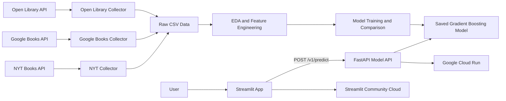

# NYT Bestseller Predictor

## Overview

This project predicts the likelihood that a book could become a New York Times bestseller using book metadata collected from public APIs. The final application includes:

- A Streamlit web app for users to enter book information
- A FastAPI model API deployed on Google Cloud Run
- A trained machine learning model served through the API
- Docker containerization for the API
- EDA, feature engineering, model comparison, and deployment artifacts

The app is designed for an author, publisher, student, or reader who wants to estimate bestseller likelihood from information such as publisher, publication year, page count, edition count, subjects, language, and digital availability.

## Local Setup

Create and activate a virtual environment:

```bash
python -m venv .venv
source .venv/bin/activate
```

Install dependencies:

```bash
pip install -r requirements.txt
```

## Recommended Run Order

For most users, the deployed API is already running, so only the Streamlit app needs to be started locally.

Run the Streamlit app against the deployed API:

```bash
API_URL=https://nyt-bestseller-api-701318602800.us-west1.run.app \
.venv/bin/python -m streamlit run app.py
```

If you want to run the full project locally, start the backend first and then the frontend:

1. Start the FastAPI backend:

```bash
.venv/bin/python -m uvicorn api:app --reload
```

2. Start the Streamlit frontend in a second terminal:

```bash
API_URL=http://127.0.0.1:8000 \
.venv/bin/python -m streamlit run app.py
```

3. Open the Streamlit local URL shown in the terminal.
4. Enter book information and submit the form to call the model API.

Run API smoke tests:

```bash
.venv/bin/python -m unittest test_api.py
```

## Deployed Services

Model API:

```text
https://nyt-bestseller-api-701318602800.us-west1.run.app
```

API documentation:

```text
https://nyt-bestseller-api-701318602800.us-west1.run.app/docs
```

Streamlit app:

```text
https://nyt-bestseller-predictor-w7mt68wavpae92mu6ejhew.streamlit.app/
```

## Data Sources

The dataset was built from public book metadata sources:

- New York Times Books API: bestseller list entries and bestseller labels
- Google Books API: title, author, publisher, publication date, page count, description, language, and categories
- Open Library API: edition count, first publication year, subjects, languages, page counts, ebook access, author metadata, and related edition/work information

Negative samples were collected from books that were not found on the NYT bestseller list. These examples were used so the model could learn the difference between likely bestseller and non-bestseller patterns.

## Final Dataset

The final processed dataset is stored at:

```text
data/processed/class_comparison_feature_design.csv
```

Final dataset characteristics:

- Total books: 7,304
- NYT bestsellers: 1,811
- Non-bestsellers: 5,493
- Class balance: about 1 bestseller to 3 non-bestsellers
- Target variable: `is_bestseller`

Final source columns:

```text
isbn13_clean
title
author
publisher
publish_year
page_count
ol_edition_count
ol_subjects
ol_ebook_access
ol_languages
ol_first_publish_year
is_bestseller
```

## Data Collection Pipeline

Important scripts:

```text
src/data_collection/nyt_collector.py
src/data_collection/googlebooks_collector.py
src/data_collection/open_library_collector.py
src/data_collection/negative_sampler.py
src/data_collection/rebuild_google_books_csv.py
```

Main data outputs:

```text
data/raw/nyt_google_enriched.csv
data/raw/open_library_enriched.csv
data/raw/negative_samples.csv
data/processed/class_comparison_feature_design.csv
```

## Data Cleaning And Preprocessing

Preprocessing included:

- Cleaning and standardizing ISBN-13 values for matching
- Merging metadata from NYT, Google Books, and Open Library sources
- Removing duplicate records where possible
- Converting publication years, page counts, and edition counts into numeric fields
- Treating zero page counts as missing values
- Preserving incomplete rows instead of dropping them
- Creating missingness indicators for sparse metadata fields
- Creating derived modeling features such as book age, publication gap, log page count, log edition count, subject count, and language count
- Grouping high-cardinality fields such as publisher and author
- Removing NYT-specific subject tags from Open Library data to reduce target leakage

## EDA And Feature Design

EDA was completed in:

```text
analyze_data.py
reports/eda_feature_design_summary.md
reports/eda_outputs/
figures/
```

The EDA focused on:

- Class balance between NYT bestsellers and negative samples
- Feature coverage comparison for positives vs negatives
- Side-by-side distributions for page count, edition count, and publish year
- Missingness across Google Books and Open Library fields
- Feature candidates for modeling

Key feature design decisions:

- Dropped NYT-specific target leakage fields from the classifier
- Treated zero page counts as missing
- Added missingness indicators for sparse fields
- Used log transforms for skewed numeric fields such as edition count and page count
- Encoded high-cardinality text/list fields with grouped categories and top subject indicators
- Removed Open Library subject tags that directly revealed NYT bestseller status, such as `nyt:` and `New York Times bestseller`

## Modeling

Model training is implemented in:

```text
modeling.py
```

The modeling pipeline compares:

- Logistic regression baseline
- Random forest
- Gradient boosting
- XGBoost

The selected model is a scikit-learn gradient boosting classifier because it produced the strongest held-out average precision while remaining simple to deploy.

Held-out test metrics:

| Model | Average Precision | ROC AUC | F1 | Precision | Recall | Accuracy |
|---|---:|---:|---:|---:|---:|---:|
| Gradient Boosting | 0.9637 | 0.9788 | 0.9094 | 0.9839 | 0.8453 | 0.9582 |
| XGBoost | 0.9630 | 0.9788 | 0.9081 | 0.9157 | 0.9006 | 0.9548 |
| Random Forest | 0.9618 | 0.9787 | 0.9058 | 0.9083 | 0.9033 | 0.9535 |
| Logistic Regression | 0.9615 | 0.9751 | 0.9031 | 0.8922 | 0.9144 | 0.9514 |

Saved model artifact:

```text
models/bestseller_model.joblib
```

Model reports:

```text
reports/modeling/model_comparison.csv
reports/modeling/feature_importance.csv
reports/modeling/test_predictions.csv
```

## API

The API is implemented with FastAPI:

```text
api.py
```

Endpoints:

```text
GET  /health
GET  /model-info
GET  /v1/model-info
POST /predict
POST /v1/predict
POST /predict-batch
POST /v1/predict-batch
```

Example request:

```bash
curl -X POST https://nyt-bestseller-api-701318602800.us-west1.run.app/v1/predict \
  -H "Content-Type: application/json" \
  -d '{"title":"Fourth Wing","author":"Rebecca Yarros","publisher":"Red Tower Books","publish_year":2023,"page_count":528,"ol_edition_count":1,"ol_subjects":["Fantasy","Romance","Dragons"],"ol_ebook_access":"no_ebook","ol_languages":["eng"],"ol_first_publish_year":2023}'
```

Example response:

```json
{
  "bestseller_probability": 0.9684,
  "prediction": 1,
  "label": "likely_bestseller",
  "threshold": 0.5,
  "model_name": "gradient_boosting"
}
```

## Streamlit App

The user-facing app is implemented in:

```text
app.py
```

Users can enter:

- Title
- Author
- Publisher
- Original publication year
- Edition publication year
- Page count
- Number of editions
- Genres or subjects
- Language
- Digital availability

The app calls the deployed FastAPI service and displays the bestseller probability.

For local testing against the deployed API:

```bash
API_URL=https://nyt-bestseller-api-701318602800.us-west1.run.app \
.venv/bin/python -m streamlit run app.py
```

For Streamlit Community Cloud, add this secret:

```toml
API_URL = "https://nyt-bestseller-api-701318602800.us-west1.run.app"
```

## Docker And Cloud Run Deployment

API container files:

```text
Dockerfile.api
requirements-api.txt
cloudbuild.yaml
.dockerignore
.gcloudignore
```

Google Cloud settings used:

```bash
PROJECT_ID=turnkey-banner-497901-p2
REGION=us-west1
REPO=nyt-bestseller
IMAGE=nyt-bestseller-api
IMAGE_URI="${REGION}-docker.pkg.dev/${PROJECT_ID}/${REPO}/${IMAGE}:latest"
```

Build and push the API image:

```bash
gcloud builds submit \
  --config cloudbuild.yaml \
  --substitutions=_IMAGE_URI=$IMAGE_URI
```

Deploy to Cloud Run:

```bash
gcloud run deploy $IMAGE \
  --image $IMAGE_URI \
  --platform managed \
  --region $REGION \
  --allow-unauthenticated
```

## Solution Architecture Diagram

The diagram below is written in Mermaid. GitHub renders Mermaid diagrams automatically inside Markdown files when they are placed in a fenced code block marked `mermaid`.



## AI Assistant Usage

AI assistants were used during development for:

- Refactoring EDA code into reusable outputs
- Creating the feature engineering strategy for modeling
- Implementing model comparison across logistic regression, random forest, gradient boosting, and XGBoost
- Building the FastAPI prediction API
- Building the Streamlit user interface
- Debugging deployment issues 

Examples of useful prompts included:

- "Add class balance, feature coverage comparison, and shared feature distributions to my EDA."
- "Create a modeling.py file with baseline, random forest, gradient boosting, and XGBoost comparison."
- "Create a FastAPI prediction API that loads my saved model."
- "Create a Streamlit app that calls the deployed API."

AI-generated code was reviewed and modified for project-specific details, especially:

- Removing target leakage from Open Library subject tags
- Keeping user-facing labels generic instead of exposing source-specific names like Open Library
- Matching the Dockerfile and Cloud Build configuration to Google Cloud Run requirements
- Keeping the model API separate from the Streamlit app

### FastAPI Instead Of MCP

I did not implement a Model Context Protocol (MCP) server for this project because the main user flow only requires a standard prediction request from the Streamlit app to a deployed model service. FastAPI was a better fit for this use case because it provides request validation, automatic Swagger/OpenAPI documentation, simple JSON prediction endpoints, and straightforward deployment to Google Cloud Run. An MCP server would be more useful if the goal were to let AI agents call the bestseller predictor as one tool among many.

## Error Handling, Logging, And Documentation

The project includes several production-oriented pieces:

- FastAPI request validation with Pydantic models
- Automatic Swagger/OpenAPI documentation at `/docs`
- API health check at `/health`
- API smoke tests for `/health`, `/v1/model-info`, and `POST /v1/predict`
- Error handling for failed prediction requests
- Logging in the API for prediction requests and failures
- Docker health check for the API container
- `.dockerignore` and `.gcloudignore` files to keep deployment contexts small

Run API smoke tests locally:

```bash
.venv/bin/python -m unittest test_api.py
```

## Known Limitations And Future Work

- Bestseller prediction is probabilistic and should not be interpreted as a guarantee.
- Some metadata fields are sparse, especially Open Library fields for NYT positives.
- The negative sample set is useful for modeling but may not represent every type of non-bestseller book.
- Publisher and subject metadata may introduce collection-source bias.
- Future work could add richer text features from descriptions, better author-history features, and automated retraining. In addition, address for any overfitting. 

## Lessons Learned

This project showed that data quality and feature design are just as important as model choice. A large part of the work involved collecting reliable metadata, handling missing fields, and making sure the model did not learn from leaked NYT-specific labels. I also learned that deployment is a separate engineering step from modeling: the model needed a FastAPI service, Docker container, Cloud Run deployment, and a Streamlit frontend that could call the deployed API.

Future improvements could include better probability calibration, individual prediction explanations with SHAP, a database-backed submission log, more recent data, larger negative samples, and automated CI/CD deployment from GitHub.

## Repository Map

```text
app.py                          Streamlit user interface
api.py                          FastAPI model service
modeling.py                     Feature engineering and model training
analyze_data.py                 EDA and feature design outputs
src/data_collection/            Data collection and utility scripts
models/bestseller_model.joblib  Saved model artifact
reports/                        EDA and modeling summaries
figures/                        EDA visualizations
Dockerfile.api                  API container definition
cloudbuild.yaml                 Google Cloud Build configuration
requirements.txt                App/local dependencies
requirements-api.txt            API container dependencies
```

## Insightful Links:
https://www.nytimes.com/books/best-sellers/methodology/
https://www.vox.com/culture/2017/9/13/16257084/bestseller-lists-explained
